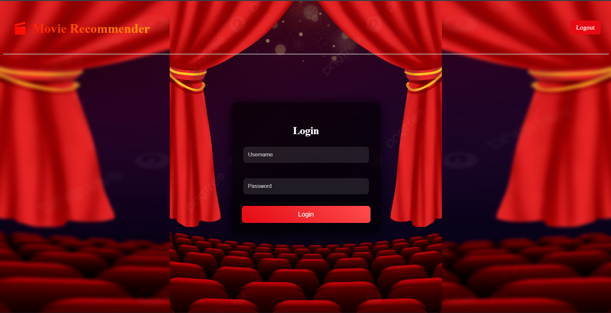
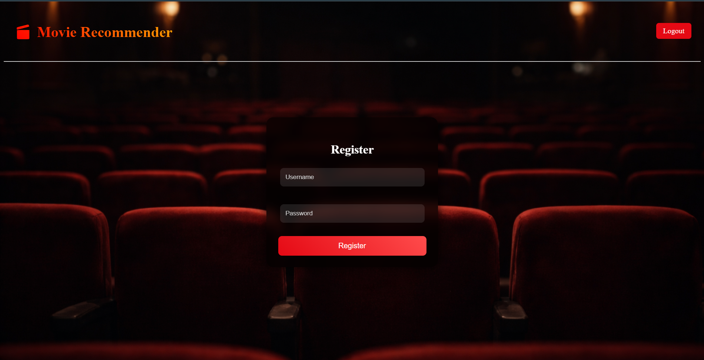
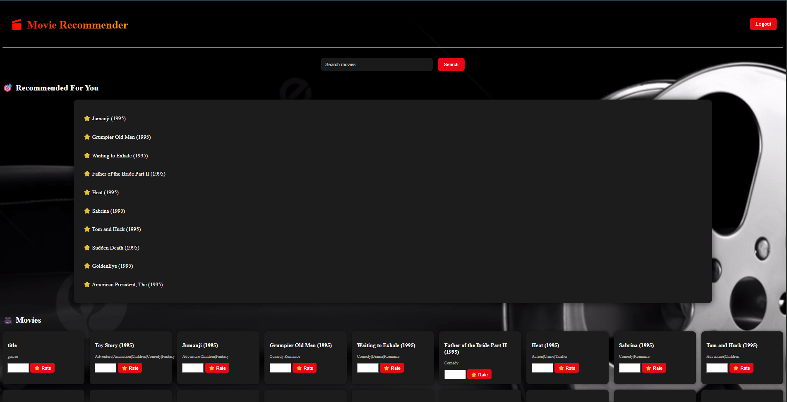

# 🎬 Movie Recommendation System


> A full-stack **Movie Recommendation System** that suggests movies based on user preferences and ratings.  
> This project combines **PHP, MySQL, and a Machine Learning API (Flask)** to deliver personalized recommendations in real time.  
> The frontend is deployed using **InfinityFree**, while the ML backend is hosted on **Render**.

---

## 🌐 Live Demo

- 🔗 **Frontend (Website):** https://akarshkumar.gt.tc  
- 🤖 **ML API (Render):** https://movie-recommendation-api-mpsa.onrender.com  

---

## 🔗 Access Pages

You can directly explore different parts of the application:

- 🔐 **Login Page:**  
  https://akarshkumar.gt.tc/index.php

- 📝 **Register Page:**  
  https://akarshkumar.gt.tc/register.php

- 🎥 **Dashboard (after login):**  
  https://akarshkumar.gt.tc/dashboard.php

> ⚠️ Note: You must log in to access the dashboard and receive recommendations.

---

## 🧪 Test Credentials

You can use the following demo account to test the application:

- 👤 **Username:** testuser  
- 🔑 **Password:** 123456  

> ⚠️ Note: This is a demo account. You can also register a new account.

---

## 🚀 Features

- 🔐 User Authentication (Login / Register / Logout)
- 🎥 Browse Movies from Database
- ⭐ Rate Movies (1–5 scale)
- 🎯 Personalized Recommendations (ML-based)
- 🔍 Search Movies
- 🌙 Modern UI with Glassmorphism Design
- ⚡ Real-time recommendations via deployed API

---

## 🧠 Tech Stack

| Layer            | Technology                           |
| ---------------- | ------------------------------------ |
| Frontend         | HTML, CSS                            |
| Backend          | PHP                                  |
| Database         | MySQL (InfinityFree)                 |
| Machine Learning | Python (Flask, Pandas, Scikit-learn) |
| Deployment       | InfinityFree + Render                |

---

## 📁 Project Structure

```plaintext
movie_recommendation/
├── app.py                # Python script for handling movie recommendation logic
│
├── css/
│   └── style.css         # Contains all UI styling for the website
│
├── images/
│   └── (assets)          # Stores background and UI images used in the project
│
├── partials/
│   ├── header.php        # Common header (navbar + CSS/JS links)
│   └── footer.php        # Common footer for all pages
│
├── index.php             # Login page for user authentication
├── register.php          # User registration page
├── dashboard.php         # Main dashboard with movies and recommendations
├── rate.php              # Handles movie rating submission
├── logout.php            # Ends user session and logs out
├── config.php            # Database connection configuration
│
├── screenshots/          # Contains images used in README (UI previews)
└── README.md             # Project documentation
```

---

## ⚙️ How It Works

* Users register and log in

* Movies are fetched from MySQL database

* Users rate movies

* Ratings are sent to the Flask ML API (Render)

* API uses Collaborative Filtering (Cosine Similarity)

* Returns personalized movie recommendations


---

## 🤖 ML Recommendation API

### Hosted on Render

* Endpoint:


https://movie-recommendation-api-mpsa.onrender.com/recommend?user_id=1

Input: user_id

Output: List of recommended movies


---

## 🖼️ Screenshots

### 🔐 Login Page



### 📝 Register Page



### 🎥 Dashboard




---

## 🎨 UI Highlights

* 🌙 Cinematic movie-themed background

* 🧊 Glassmorphism forms

* 🔥 Smooth hover effects

* 🎬 Clean dashboard layout


---

## 📊 Dataset

* MovieLens Dataset (Kaggle)

* Includes:

   * Movies

   * Ratings

   * Genres


---

## 💡 Future Improvements

* ⭐ Star-based rating UI

* 🎞️ Movie posters integration

* 📱 Mobile responsive design

* 🔒 Use bcrypt instead of md5

* ⚡ Improve API performance


---

## ⚠️ Note

This project is for learning/demo purposes

Basic security implemented (can be improved)


---

## 👤 Author

Akarsh Kumar
B.Tech (AI & ML)

---

⭐ If you like this project, don’t forget to star the repository!
